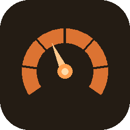

<p align="center">
  
</p>

<h1 align="center">ClaudeMeter</h1>

<p align="center">
  Native macOS menu bar app that shows your <a href="https://claude.ai">Claude.ai</a> usage limits in real time.
</p>

<p align="center">
  
  
  
</p>

---

## Features

- 🟠 Menu bar icon with live usage percentage
- 📊 Segmented usage bars with color coding (green → yellow → orange → red)
- 🔄 Auto-refresh every 1, 2, 5, or 15 minutes
- 🖱️ Right-click for quick Refresh / Settings / Quit
- 📐 Notification Center widget (small & medium)
- 🔑 Session key stored securely in Keychain

## Installation

### Download (recommended)

1. Download **ClaudeMeter-v1.0.zip** from the [latest release](https://github.com/massimiliano-volpiana/claude-meter/releases/latest)
2. Unzip and drag **ClaudeMeter.app** to your `/Applications` folder
3. Open it — right-click → Open the first time (signed but not notarized)
4. Enter your Claude.ai session key in Settings

### Build from source

Requires Xcode Command Line Tools and an Apple Developer account.

```bash
git clone https://github.com/massimiliano-volpiana/claude-meter.git
cd claude-meter
make install
```

## Getting your session key

1. Open [claude.ai](https://claude.ai) in your browser
2. Open DevTools → Application → Cookies
3. Copy the value of `sessionKey`
4. Paste it in ClaudeMeter Settings

## Requirements

- macOS 12 Monterey or later
- A Claude.ai account

## License

MIT
